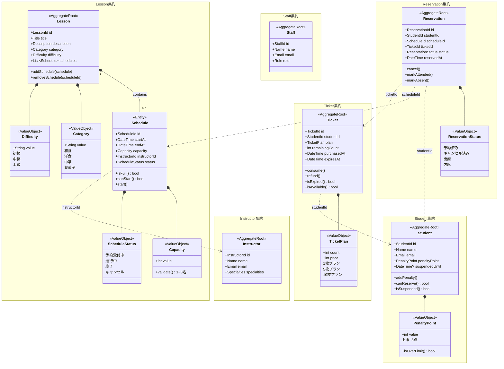
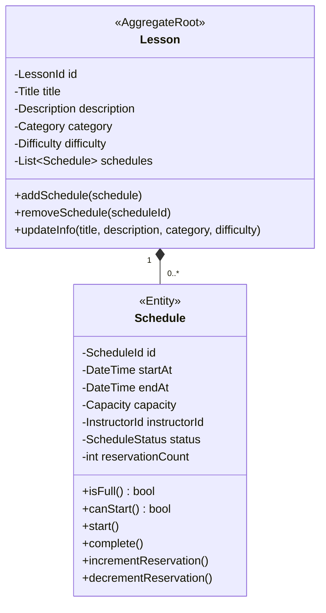
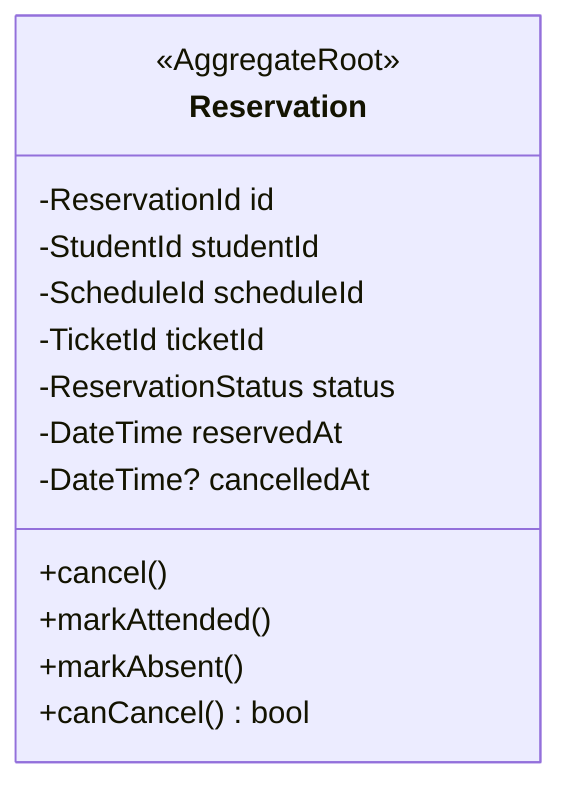
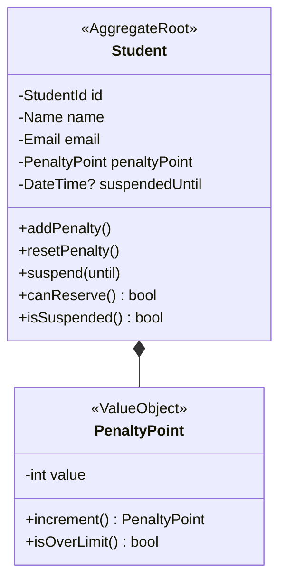
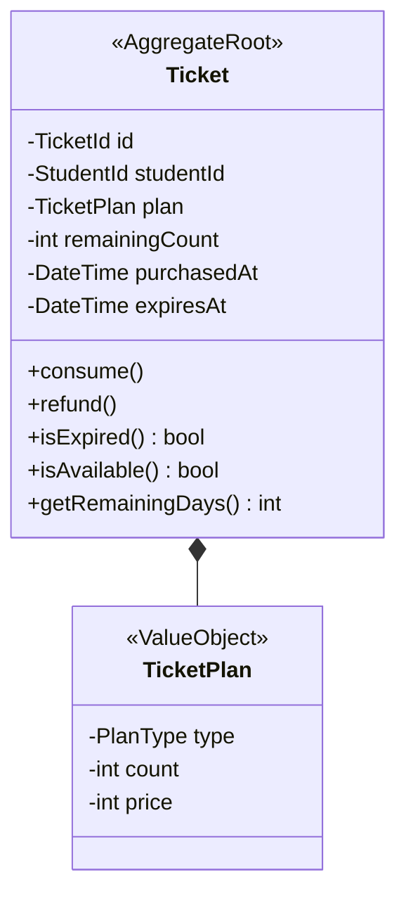
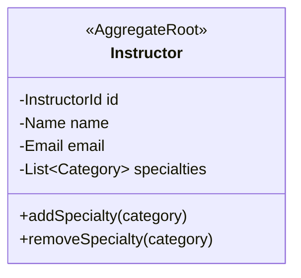
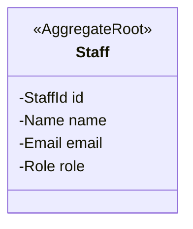
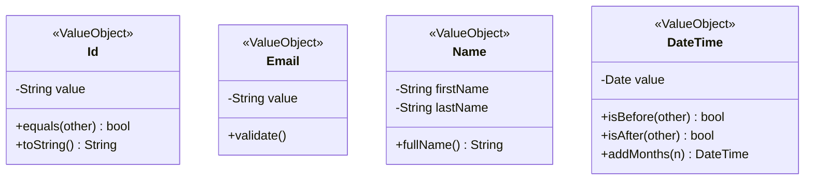
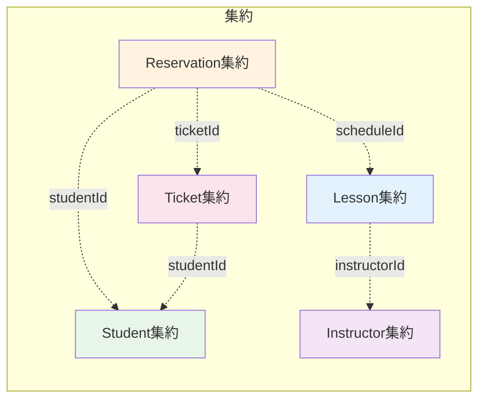

# ドメインモデル図

DDDに基づいたドメインモデルの構造を示します。

## 全体ドメインモデル図

## 集約の説明

### Lesson集約（レッスン）

レッスンとそのスケジュールを管理する集約。

| 要素 | 種類 | 説明 |
|------|------|------|
| Lesson | 集約ルート | レッスンの基本情報を保持 |
| Schedule | エンティティ | 開催日程・定員・講師を保持 |
| Category | 値オブジェクト | 和食/洋食/中華/お菓子 |
| Difficulty | 値オブジェクト | 初級/中級/上級 |
| Capacity | 値オブジェクト | 定員（1〜8名） |

### Reservation集約（予約）

生徒のレッスン予約を管理する集約。

| 要素 | 種類 | 説明 |
|------|------|------|
| Reservation | 集約ルート | 予約情報と状態を保持 |
| ReservationStatus | 値オブジェクト | 予約済み/キャンセル済み/出席/欠席 |

**ビジネスルール**:
- 開催24時間前までキャンセル可能
- 同一スケジュールへの重複予約不可

### Student集約（生徒）

生徒情報とペナルティを管理する集約。

| 要素 | 種類 | 説明 |
|------|------|------|
| Student | 集約ルート | 生徒の基本情報を保持 |
| PenaltyPoint | 値オブジェクト | ペナルティポイント（上限3点） |

**ビジネスルール**:
- ペナルティ3点で1ヶ月間予約停止

### Ticket集約（チケット）

チケットの購入・消費を管理する集約。

| 要素 | 種類 | 説明 |
|------|------|------|
| Ticket | 集約ルート | チケットの残数・有効期限を保持 |
| TicketPlan | 値オブジェクト | 1枚/5枚/10枚プラン |

**ビジネスルール**:
- 有効期限: 購入日から6ヶ月
- 消費順序: FIFO（有効期限が近いものから）

### Instructor集約（講師）

講師情報を管理する集約。

### Staff集約（運営スタッフ）

運営スタッフ情報を管理する集約。

## 共有カーネル（Shared Kernel）

複数の集約で共有される値オブジェクト。

## 集約間の関係

**注意**: 集約間はIDによる参照のみ。直接オブジェクト参照は行わない。

## ドメインサービス

集約をまたぐビジネスロジックはドメインサービスで実装。

| サービス | 責務 |
|---------|------|
| ReservationService | 予約作成時のチケット消費・定員チェック・重複チェック |
| TicketConsumptionService | FIFO順でのチケット選択・消費 |
| AttendanceService | 出欠記録・ペナルティ付与 |
