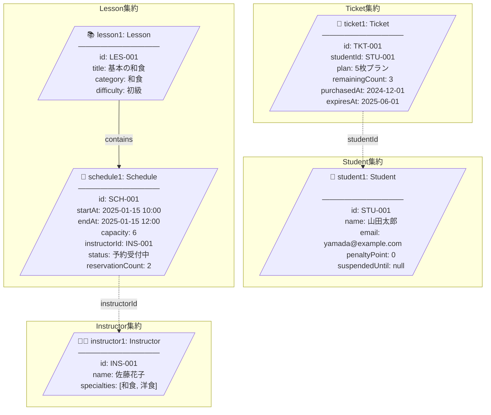
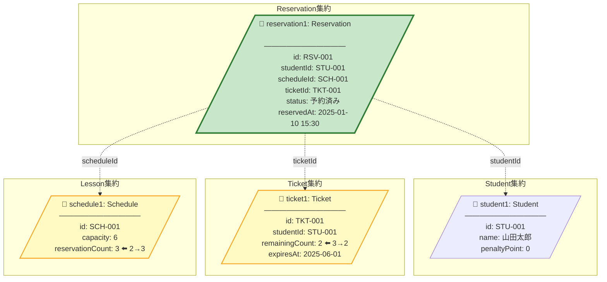
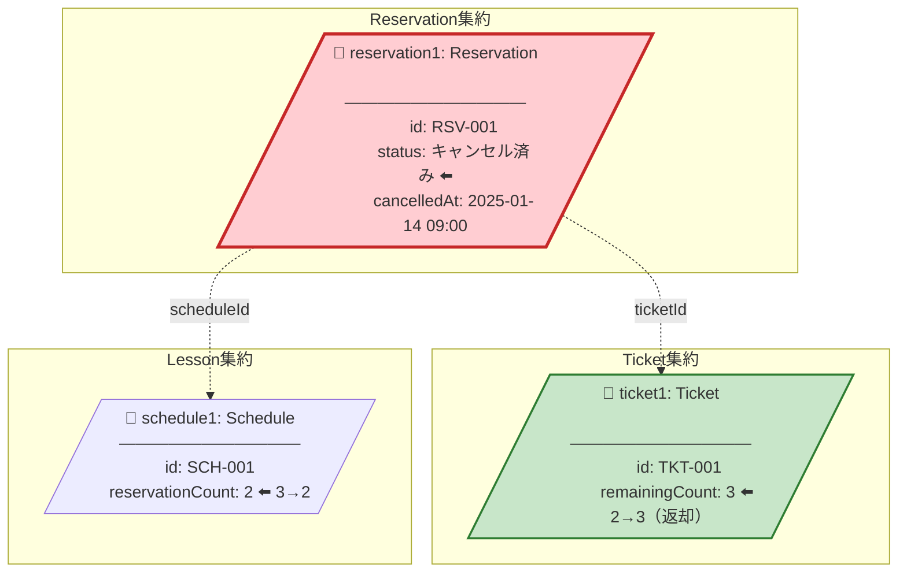
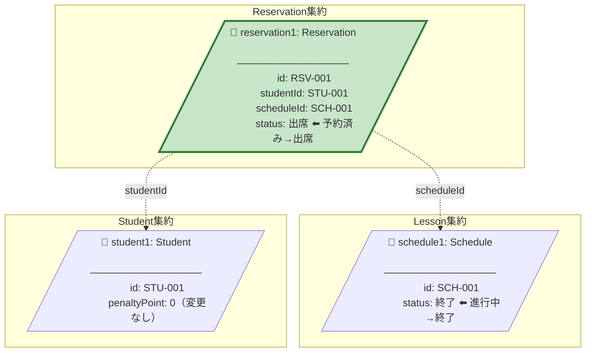
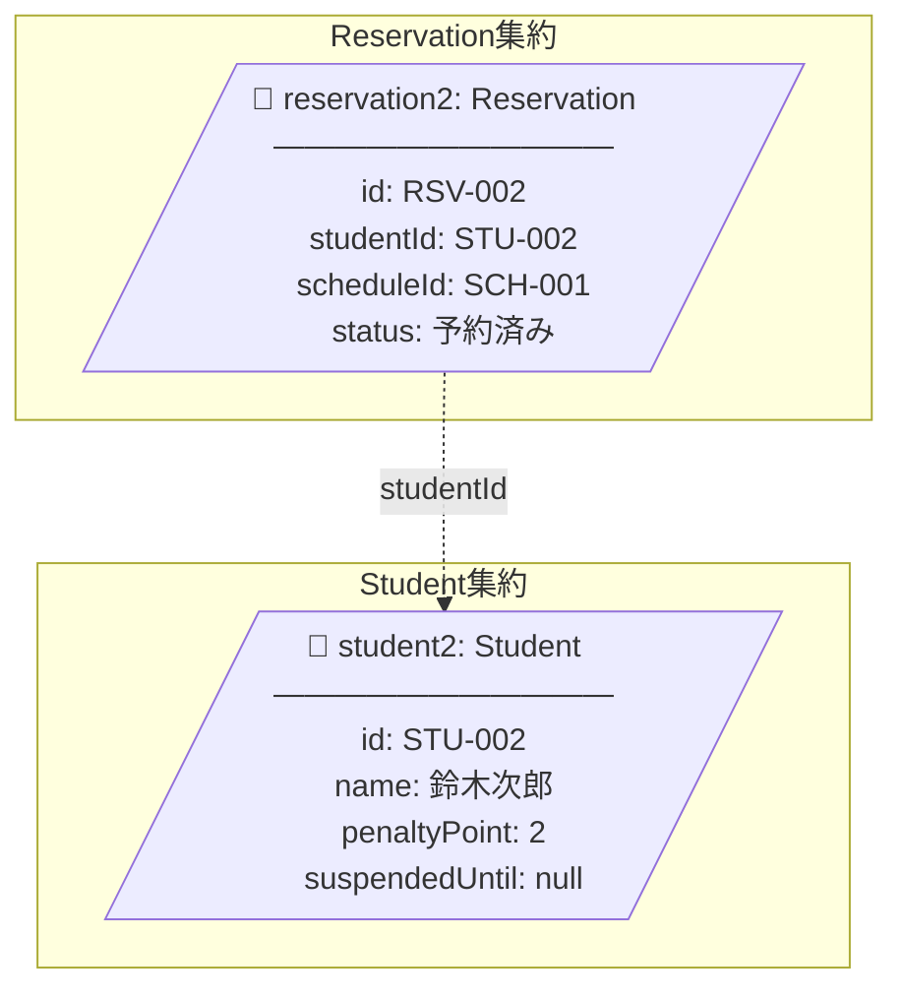
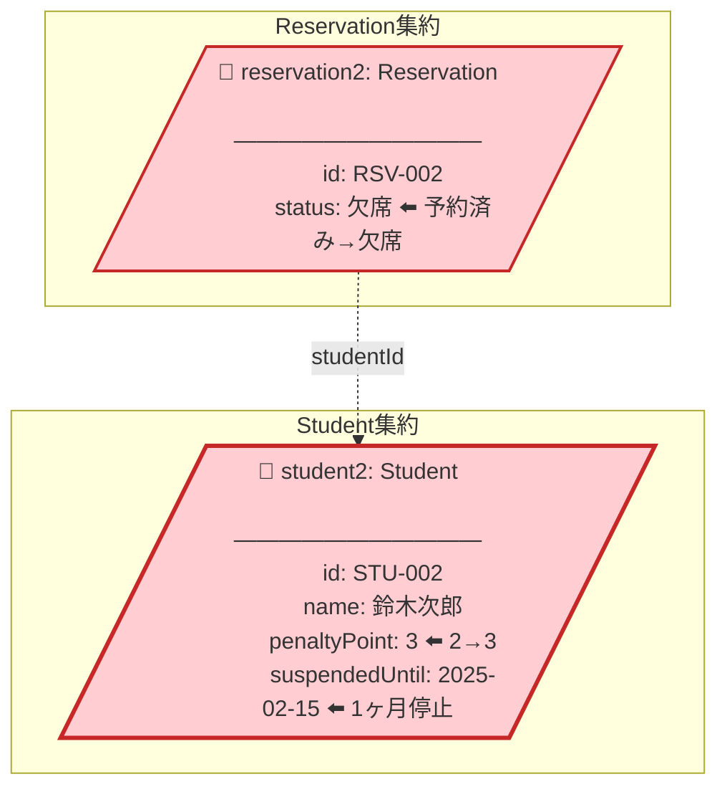
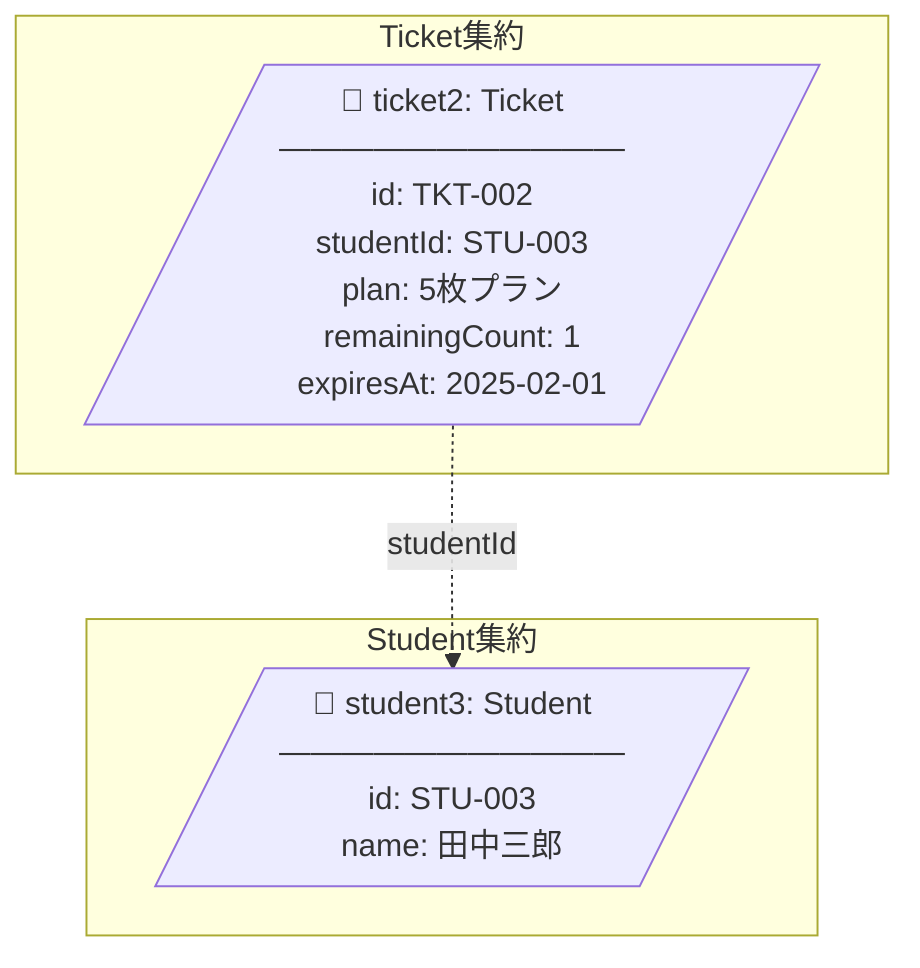
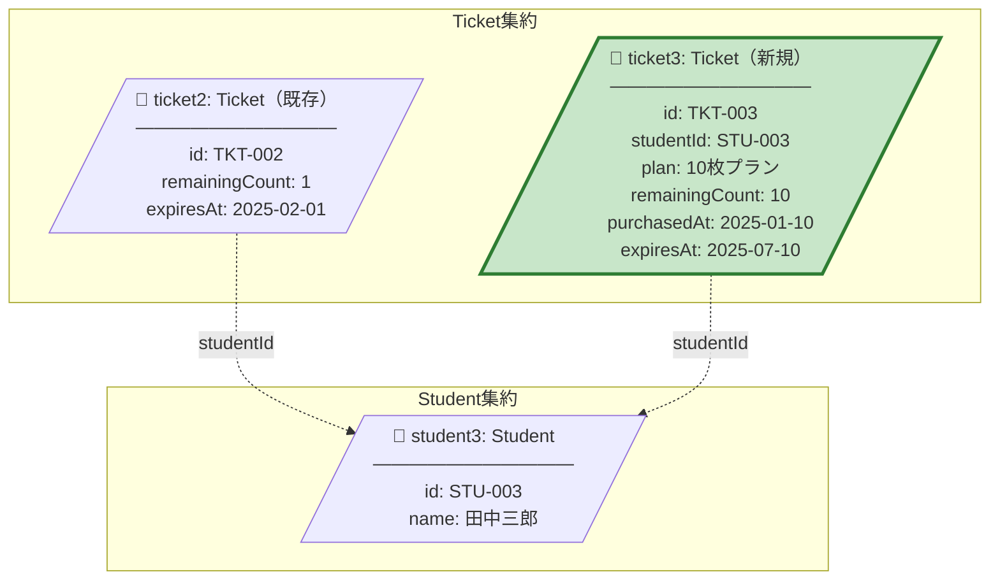
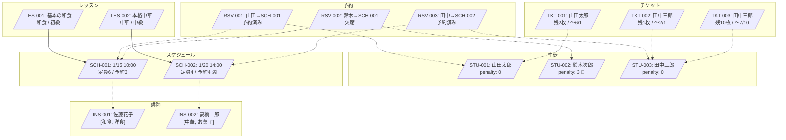

# オブジェクト図

ドメインモデルの具体的なインスタンス例を示します。

## シナリオ1: レッスン予約

生徒「山田太郎」が「基本の和食」レッスンの1月15日開催スケジュールを予約するシナリオ。

### 予約前の状態

### 予約後の状態

**変更点**:
| オブジェクト | 属性 | 変更前 | 変更後 |
|-------------|------|--------|--------|
| ticket1 | remainingCount | 3 | 2 |
| schedule1 | reservationCount | 2 | 3 |
| reservation1 | - | (新規作成) | 予約済み |

---

## シナリオ2: 予約キャンセル

生徒「山田太郎」が予約をキャンセルするシナリオ（開催24時間前まで）。

### キャンセル後の状態

**変更点**:
| オブジェクト | 属性 | 変更前 | 変更後 |
|-------------|------|--------|--------|
| reservation1 | status | 予約済み | キャンセル済み |
| reservation1 | cancelledAt | null | 2025-01-14 09:00 |
| ticket1 | remainingCount | 2 | 3（返却） |
| schedule1 | reservationCount | 3 | 2 |

---

## シナリオ3: 出欠記録（出席）

講師「佐藤花子」がレッスン終了後、生徒「山田太郎」に出席を記録するシナリオ。

---

## シナリオ4: 出欠記録（無断欠席）

生徒「鈴木次郎」が無断欠席し、ペナルティが付与されるシナリオ。

### 欠席記録前

### 欠席記録後（ペナルティ3点到達 → 予約停止）

**変更点**:
| オブジェクト | 属性 | 変更前 | 変更後 |
|-------------|------|--------|--------|
| reservation2 | status | 予約済み | 欠席 |
| student2 | penaltyPoint | 2 | 3 |
| student2 | suspendedUntil | null | 2025-02-15（1ヶ月後） |

---

## シナリオ5: チケット購入

生徒「田中三郎」が10枚プランのチケットを購入するシナリオ。

### 購入前

### 購入後

**ポイント**: チケットはFIFO消費のため、ticket2（有効期限が近い）から先に消費される。

---

## 全体オブジェクト図（サンプルデータ）

システム全体のサンプルデータ構成。

## サンプルデータ一覧

### 生徒

| ID | 名前 | ペナルティ | 停止期限 |
|----|------|-----------|---------|
| STU-001 | 山田太郎 | 0 | - |
| STU-002 | 鈴木次郎 | 3 | 2025-02-15 |
| STU-003 | 田中三郎 | 0 | - |

### 講師

| ID | 名前 | 専門 |
|----|------|------|
| INS-001 | 佐藤花子 | 和食, 洋食 |
| INS-002 | 高橋一郎 | 中華, お菓子 |

### レッスン

| ID | タイトル | カテゴリ | 難易度 |
|----|---------|---------|--------|
| LES-001 | 基本の和食 | 和食 | 初級 |
| LES-002 | 本格中華 | 中華 | 中級 |

### スケジュール

| ID | レッスン | 開催日時 | 定員 | 予約数 | 講師 |
|----|---------|---------|------|--------|------|
| SCH-001 | LES-001 | 2025-01-15 10:00 | 6 | 3 | INS-001 |
| SCH-002 | LES-002 | 2025-01-20 14:00 | 4 | 4 | INS-002 |

### チケット

| ID | 生徒 | プラン | 残数 | 有効期限 |
|----|------|--------|------|---------|
| TKT-001 | STU-001 | 5枚 | 2 | 2025-06-01 |
| TKT-002 | STU-003 | 5枚 | 1 | 2025-02-01 |
| TKT-003 | STU-003 | 10枚 | 10 | 2025-07-10 |

### 予約

| ID | 生徒 | スケジュール | チケット | 状態 |
|----|------|-------------|---------|------|
| RSV-001 | STU-001 | SCH-001 | TKT-001 | 予約済み |
| RSV-002 | STU-002 | SCH-001 | - | 欠席 |
| RSV-003 | STU-003 | SCH-002 | TKT-002 | 予約済み |
