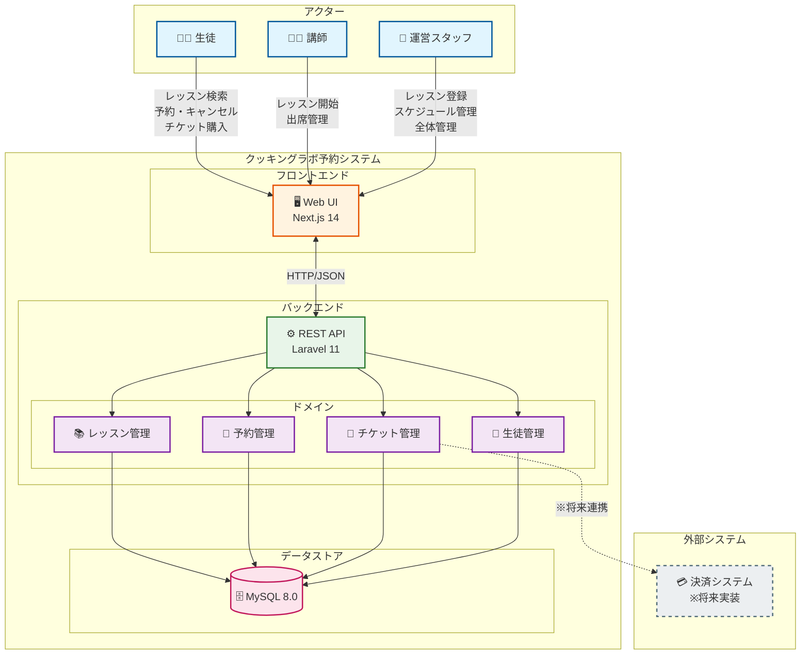

# システム関連図

システム全体の構成とアクターの関係を示します。

## 構成要素の説明

| 要素 | 説明 |
|------|------|
| **Web UI** | 生徒・講師・運営スタッフが利用するWebアプリケーション |
| **REST API** | フロントエンドからのリクエストを処理するバックエンドAPI |
| **レッスン管理** | レッスン・スケジュールの登録・更新・削除を担当 |
| **予約管理** | 予約の作成・キャンセル・出席管理を担当 |
| **チケット管理** | チケットの購入・消費・有効期限管理を担当 |
| **生徒管理** | 生徒情報・ペナルティポイント管理を担当 |
| **MySQL** | 全てのデータを永続化するリレーショナルデータベース |
| **決済システム** | チケット購入時の決済処理（将来実装予定） |

## アクターの役割

### 生徒
- レッスンの検索・閲覧
- スケジュールへの予約・キャンセル
- チケットの購入・残高確認

### 講師
- 担当レッスンの確認
- レッスンの開始操作
- 出席・欠席の記録

### 運営スタッフ
- レッスンの登録・編集・削除
- スケジュールの設定
- 講師のアサイン
- 全体の管理・監視
