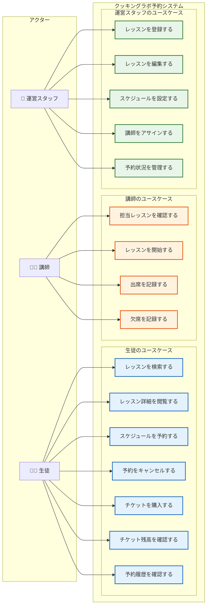
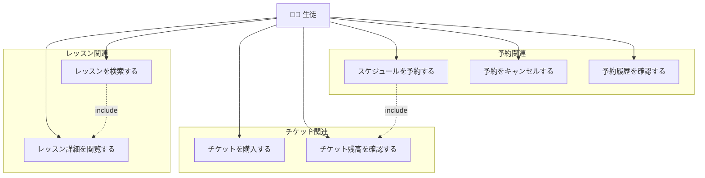
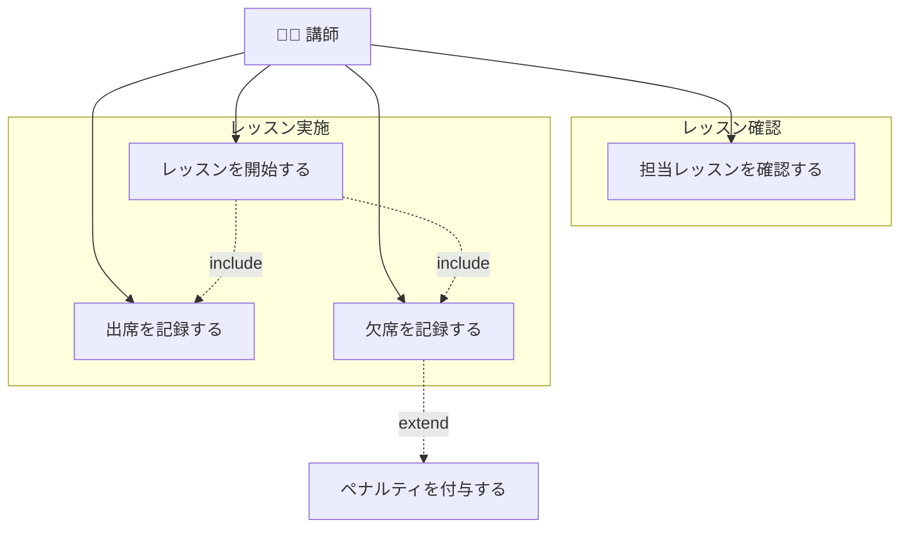
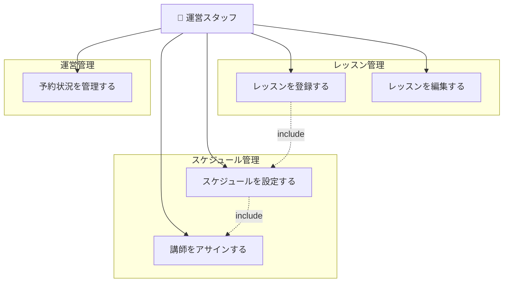

# ユースケース図

アクターごとのシステム利用シナリオを示します。

## 全体ユースケース図

## アクター別ユースケース詳細

### 生徒

| ユースケース | 説明 | 事前条件 | 事後条件 |
|-------------|------|----------|----------|
| レッスンを検索する | カテゴリ・難易度・日程でレッスンを検索 | ログイン済み | - |
| レッスン詳細を閲覧する | レッスン内容・スケジュール・空き状況を確認 | - | - |
| スケジュールを予約する | 希望のスケジュールを選んで予約 | チケット1枚以上保有、定員に空きあり | チケット1枚消費 |
| 予約をキャンセルする | 予約済みスケジュールをキャンセル | 開催24時間前まで | チケット1枚返却 |
| チケットを購入する | 1枚/5枚/10枚プランから購入 | ログイン済み | チケット追加（有効期限6ヶ月） |
| チケット残高を確認する | 保有チケット数と有効期限を確認 | ログイン済み | - |
| 予約履歴を確認する | 過去・未来の予約一覧を表示 | ログイン済み | - |

### 講師

| ユースケース | 説明 | 事前条件 | 事後条件 |
|-------------|------|----------|----------|
| 担当レッスンを確認する | 自分がアサインされたスケジュール一覧を表示 | ログイン済み | - |
| レッスンを開始する | 開催時刻以降にレッスンを開始状態にする | 開催時刻到達 | レッスン状態が「進行中」に |
| 出席を記録する | 参加した生徒に出席をつける | レッスン開始後 | 予約ステータスが「出席」に |
| 欠席を記録する | 無断欠席の生徒に欠席をつける | レッスン開始後 | ペナルティポイント+1 |

### 運営スタッフ

| ユースケース | 説明 | 事前条件 | 事後条件 |
|-------------|------|----------|----------|
| レッスンを登録する | 新規レッスン（タイトル・カテゴリ・難易度・内容）を登録 | ログイン済み | レッスンが作成される |
| レッスンを編集する | 既存レッスンの情報を更新 | レッスンが存在 | レッスン情報が更新される |
| スケジュールを設定する | レッスンに開催日程・定員（1〜8名）を設定 | レッスンが存在 | スケジュールが作成される |
| 講師をアサインする | スケジュールに講師を割り当てる | スケジュールが存在 | 講師がアサインされる |
| 予約状況を管理する | 全スケジュールの予約状況を確認・管理 | ログイン済み | - |

## ビジネスルールとの関連

| ユースケース | 関連するビジネスルール |
|-------------|----------------------|
| スケジュールを予約する | チケット消費（FIFO）、定員チェック、重複予約禁止、ペナルティ停止チェック |
| 予約をキャンセルする | 24時間前までキャンセル可、チケット返却 |
| チケットを購入する | 有効期限6ヶ月 |
| 欠席を記録する | ペナルティポイント+1、3点で1ヶ月予約停止 |
| スケジュールを設定する | 定員1〜8名 |
